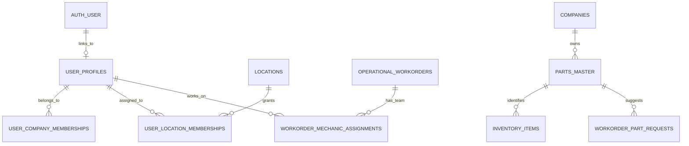

# Database Architecture

This document describes the PostgreSQL database used by the workorder application. It is developer-facing: use it to find the owner of a table, understand which record is authoritative, and plan schema changes without creating duplicate sources of truth.

## Document Status

The database has a working operational schema, Better Auth, a normalized UUID `companies` tenant root, company and location access memberships, multi-mechanic assignments, parts workflows, Samsara synchronization, and Odoo handoff tracking. Some identity, parts-master, assignment-compatibility, and reporting structures remain transitional and are identified explicitly below.

Labels used below:

- **Current**: implemented in an ordered migration under `src/server/db/migrations/`.
- **Transitional**: implemented and still required by current code, but planned for replacement.
- **Target**: design direction only; do not query or reference it until a migration and repository change implement it.

PostgreSQL is the only application database. Use one database per environment (development, staging, and production), not one database per company, location, or role.

## Current Runtime

The application is a modular monolith:

```text
HTTP route -> domain service -> repository -> PostgreSQL
                              -> external provider
```

- `src/server/db/migrations/001_initial_schema.sql` is the baseline for a clean database.
- `src/server/db/migrations/NNN_snake_case.sql` is the sole runtime schema history. There is no separate `schema.sql` bootstrap.
- `src/server/db/migrate.js` orders the migrations, takes a PostgreSQL advisory transaction lock, verifies applied SHA-256 checksums, and applies pending migrations in one transaction.
- `src/server/db/repositories/` owns SQL. Routes and React components must not issue SQL.
- Better Auth owns credential and session persistence through `src/server/auth/`.
- Railway runs `npm run db:migrate` as the service pre-deploy command.

## Domain Ownership Map

### Authentication

| Table | State | Owner | Purpose |
| --- | --- | --- | --- |
| `auth_user` | Current | Better Auth and `src/server/auth/` | Login identity, email, username, and display identity. |
| `auth_account` | Current | Better Auth | Credential/provider account records. Password hashes belong here; application code must not read or create password hashes directly. |
| `auth_session` | Current | Better Auth | Database-backed sessions and expiry. |
| `auth_verification` | Current | Better Auth | Expiring verification and account-flow tokens. |

Better Auth tables are infrastructure tables. They do not own mechanic, office, surveillance, or company workflow permissions.

### Users and Access

| Table | State | Owner | Purpose |
| --- | --- | --- | --- |
| `app_users` | Current, transitional name | `repositories/users.repo.js`, `repositories/auth-users.repo.js` | Operational user profile linked one-to-one to `auth_user` by `auth_user_id`. |
| `user_company_memberships` | Current | Auth request context | Company access and role membership using a UUID foreign key to `companies`. |
| `user_location_memberships` | Current | Auth request context and location/user repositories | Many-to-many location access. |
| `user_invitations` | Current | `repositories/invitations.repo.js` | Expiring invitations for a company, location, and role. |
| `user_workorder_preferences` | Current | `repositories/workorder-attention.repo.js` | Per-user queue defaults, page size, and saved filters. |

Current access resolution starts with the Better Auth session, loads the linked active `app_users` row, and then loads active company and location memberships. Browser-supplied user IDs are not identity truth.

Known transitional fields:

- `app_users.role` is still the global runtime role used by the permission map.
- `user_company_memberships.role` also stores the company membership role.
- `app_users.location_id` is a legacy single-location field; `user_location_memberships` is the scalable location-access model.

Target:

- Rename `app_users` to `user_profiles`.
- Resolve operational roles from company memberships, with any platform-level administrator modeled explicitly.
- Remove `app_users.location_id` after every read and write uses `user_location_memberships`.

### Companies and Locations

| Table | State | Owner | Purpose |
| --- | --- | --- | --- |
| `companies` | Current | Company/tenant database services | UUID tenant root with stable slug, display name, and active state. |
| `company_legacy_keys` | Transitional | Tenant migration compatibility | Maps historical text keys to one canonical UUID company during expand/contract rollout. |
| `locations` | Current | `repositories/locations.repo.js` | Yard/shop identity, address, coordinates, and active state. |
| `location_workorder_templates` | Current | `repositories/templates.repo.js` | One versioned printable workorder template per location. |

Migration `007_company_tenancy.sql` introduced the tenant root using an expand/contract rollout. `locations`, `operational_workorders`, `workorder_serial_counters`, `parts_catalog`, `inventory_items`, `user_company_memberships`, `user_invitations`, `assets`, `integration_accounts`, and `integration_sync_runs` now have required UUID `company_uuid` foreign keys used by new application code.

The old text `company_id` columns remain temporary dual-written compatibility projections. `company_legacy_keys` maps values such as `default`, `Long Haul`, and `Chino Yard` to the explicitly selected canonical company; those display/legacy values do not create separate tenants. New code uses `companies.id` through `company_uuid`.

### Fleet Assets

| Table | State | Owner | Purpose |
| --- | --- | --- | --- |
| `assets` | Current | `repositories/assets.repo.js` | Trucks, trailers, and future equipment from Samsara or manual entry. |

Typed columns such as `unit_no`, `unit_type`, `vin`, `license_plate`, `make`, `model`, and odometer values are search and workflow truth. `raw_provider_data` and `external_ids` preserve provider provenance; they are not the preferred query interface.

`assets.company_uuid` is a required foreign key to `companies`, and the new provider identity index is company-scoped. The former provider `organization_id` remains transitional provider metadata; it is not tenant identity. `assets.location_id` is optional because Samsara assets may not have a known repair location, but any populated location must be authorized by application scope.

### Workorders

| Table | State | Owner | Purpose |
| --- | --- | --- | --- |
| `operational_workorders` | Current | `repositories/operational-workorders.repo.js` | Canonical workorder record, lifecycle, asset/location links, work text, timestamps, and printable form snapshot. |
| `workorder_serial_counters` | Current | Workorder repository | Transaction-safe serial allocation per company UUID. |
| `workorder_mechanic_assignments` | Current | Workorder repository | Active and historical mechanic team assignments, including primary/support role. |
| `workorder_status_events` | Current | Workorder repository | Append-only lifecycle transition history. |
| `workorder_assignment_events` | Current | Workorder repository | Append-only assignment actions and reassignment reasons. |
| `workorder_field_events` | Current | Workorder repository | Audited changes to important editable workorder fields. |
| `workorder_access_events` | Current | Workorder repository | Explicit detail-open audit events. Background polling must not write these. |
| `workorder_attention_state` | Current | `repositories/workorder-attention.repo.js` | Current persisted attention reasons such as office help or missing information. |
| `workorder_attention_events` | Current | Workorder attention repository | Append-only attention history. |
| `workorder_read_state` | Current | Workorder attention repository | Per-user read position for a workorder. |
| `chat_messages` | Current | `repositories/chat.repo.js` | Workorder conversation, sender, message type, deduplication key, and body. |
| `chat_message_attachments` | Current | Chat repository and chat media service | Attachment metadata and storage key; image bytes are currently stored outside PostgreSQL. |
| `odoo_entry_status` | Current | Workorder repository and `modules/surveillance/` | Manual Odoo service-order entry state and reference. |

`operational_workorders.form_data` is the printable form snapshot and compatibility surface. It must not replace typed columns or structured child tables. In particular, structured part requests and allocations own the parts workflow; any `form_data.parts` value is a print projection or legacy manual row.

### Parts and Inventory

| Table | State | Owner | Purpose |
| --- | --- | --- | --- |
| `parts_catalog` | Current | `repositories/part-requests.repo.js`, `modules/parts/` | Company-approved part identity, normalized number, aliases, description, category, and repair template. |
| `inventory_items` | Current | Parts repository and module | Location-aware stock, reservation quantity, and bin. |
| `workorder_part_requests` | Current | Parts repository and module | Mechanic request, identification, approval, fitment, and usage state. |
| `part_allocations` | Current | Parts repository and module | Inventory, purchase, transfer, or supplied-part sourcing. |
| `part_request_events` | Current | Parts repository and module | Append-only request and sourcing history. |

OpenAI and provider responses are suggestions. Accepted company catalog data, office decisions, allocations, and usage records are the operational truth.

### Integrations

| Table | State | Owner | Purpose |
| --- | --- | --- | --- |
| `integration_accounts` | Current | `repositories/integrations.repo.js`, `integrations/samsara/` | Company-scoped provider connection state, OAuth tokens/state, cursor, and last full sync. |
| `integration_sync_runs` | Current | Integration repository | Company-scoped append-only sync run result and counts, optionally linked to an integration account. |
| `schema_migrations` | Current, created by runner | `src/server/db/migrate.js` | Applied migration name, checksum, and timestamp. |

The new integration and asset indexes are scoped by `(company_uuid, provider)` and `(company_uuid, provider, provider_vehicle_id)`. The original global provider constraint is temporarily retained so an older application binary can coexist during this release; remove it only in the later contract migration after all deployed code uses company-scoped conflict targets.

Provider tokens currently live in restricted database columns. They must never be returned to the browser or written to logs. The target should encrypt provider secrets at the application boundary or move secret material to a dedicated managed secret store while retaining non-secret connection metadata in PostgreSQL.

## Source-of-Truth Rules

Use these rules when adding a route, report, or UI:

1. **Authentication identity:** `auth_user`; credentials/providers: `auth_account`; active login: `auth_session`.
2. **Operational person:** linked `app_users` row. Do not treat an auth row as a mechanic or office profile by itself.
3. **Authorization scope:** active company and location memberships loaded by the server session context. Never accept actor, company, or location authority from the browser without server validation.
4. **Company identity:** `companies.id` and UUID `company_uuid` foreign keys. Text `company_id` and `company_legacy_keys` are rolling-deployment compatibility only.
5. **Location identity:** `locations`; access: `user_location_memberships`.
6. **Asset identity:** typed `assets` columns. Provider JSON is provenance and fallback only.
7. **Workorder identity and lifecycle:** `operational_workorders`.
8. **Mechanic team:** active rows in `workorder_mechanic_assignments`.
9. **Primary mechanic compatibility projection:** `operational_workorders.current_mechanic_id`. Current transaction code keeps it aligned with the active primary assignment; new features must query the assignment table for the complete team.
10. **Lifecycle history:** `workorder_status_events`; assignment history: `workorder_assignment_events`; field audit: `workorder_field_events`.
11. **Operational attention:** `workorder_attention_state` plus derived signals in the authorized operations query. Attention does not become a lifecycle status.
12. **Unread state:** `workorder_read_state`, scoped by user and workorder. `chat_messages.read_by` is legacy message metadata and must not become the global workorder unread truth.
13. **Conversation:** `chat_messages`; attachment metadata: `chat_message_attachments`; binary storage is external to the relational model.
14. **Parts:** `workorder_part_requests`, `part_allocations`, `inventory_items`, and `parts_catalog`. Printable JSON is a projection.
15. **Odoo handoff:** `odoo_entry_status` owns manual service-order entry status/reference. `operational_workorders.status = 'odoo_entered'` is the final overall lifecycle state.
16. **Integration synchronization:** typed `assets` fields and `integration_sync_runs`; raw provider payloads are diagnostic/provenance data.
17. **Generated PDFs and share packages:** output artifacts, never the source workorder record.

## Lifecycle and Assignment Truth

### Canonical Lifecycle

After migration `009_operational_database_views.sql`, valid stored workorder lifecycle values are:

```text
open -> accepted -> in_progress -> mechanic_done -> closed -> odoo_entered
cancelled is a terminal exit from any unfinished state
```

- `open`: available or unassigned.
- `accepted`: at least one mechanic has accepted/been assigned; work has not started.
- `in_progress`: mechanic work is underway.
- `mechanic_done`: mechanic team submitted the work for office review.
- `closed`: office completed its review and closed the workorder.
- `odoo_entered`: surveillance recorded the Odoo service order.
- `cancelled`: work was intentionally stopped; it is terminal and remains distinguishable from completed work.

`waiting_office` and `parts_requested` remain legacy input compatibility values only. A database trigger normalizes those writes into the existing canonical lifecycle and separate attention/request records. New code must not write those queue labels as lifecycle.

### Attention Is Not Status

Parts needed, office help, missing information, overdue work, and unread activity are queue signals. They may overlap and must not replace `operational_workorders.status`.

- Persisted attention: `workorder_attention_state`.
- Attention audit: `workorder_attention_events`.
- Parts attention: derived from pending `workorder_part_requests`.
- Overdue: derived from timestamps and policy thresholds.
- Unread: derived per user from activity and `workorder_read_state`.

### Multi-Mechanic Assignment

`workorder_mechanic_assignments` is the mechanic-team truth:

- At most one active primary mechanic per workorder.
- A mechanic can have only one active assignment row per workorder.
- Additional active mechanics use `assignment_role = 'support'`.
- Leaving/reassigning deactivates the row and records `released_at`; do not delete assignment history.
- `workorder_assignment_events` records the business action and actor.

`operational_workorders.current_mechanic_id` is transitional. Keep it synchronized in the same database transaction until every read path has moved to the assignment table, then remove it through an expand/contract migration.

## Naming Rules

Apply these rules to all new database work:

- Use lowercase `snake_case`.
- Use plural table names for application-owned entities. Better Auth singular table names are vendor-owned exceptions.
- Use `id uuid primary key default gen_random_uuid()` for application-owned aggregate/entity IDs.
- Foreign keys use `<referenced_entity>_id` and the same type as the referenced primary key.
- Timestamps use `timestamptz` and UTC semantics. Standard mutable tables use `created_at` and `updated_at`; append-only event tables use `created_at`.
- Boolean state uses a positive name such as `active`; do not introduce ambiguous flags like `disabled_flag`.
- Enumerated workflow values use lowercase `snake_case` text with a `check` constraint until a shared PostgreSQL enum provides a clear migration advantage.
- Money uses `numeric(12, 2)` or a documented integer-minor-unit model; never `float`.
- Quantities use integer or numeric with explicit non-negative/range checks.
- Business keys are tenant-scoped. Prefer unique constraints such as `(company_id, normalized_part_number)`.
- Index names follow `<table>_<purpose>_idx`; unique indexes end in `_uidx` where practical.
- Foreign key delete behavior must be explicit:
  - `cascade` for children with no meaning outside the parent;
  - `restrict` for referenced operational identities that must remain auditable;
  - `set null` when history must survive removal of an optional reference.
- JSONB is allowed for raw provider payloads, provider-specific IDs, immutable snapshots, flexible metadata, and user filter preferences. Do not hide searchable or constrained business fields inside JSONB.
- Append-only tables end in `_events` or `_runs`. Update/delete access should be exceptional and documented.
- Read-only database projections use a `v_` prefix.

## Migration Rules

### Current Mechanism

1. Migration files are read from `src/server/db/migrations/` and sorted lexically.
2. `schema_migrations` is created if needed.
3. Applied migration SHA-256 checksums are verified.
4. Pending `NNN_snake_case.sql` migrations run in order, starting from `001_initial_schema.sql` on a clean database.
5. The entire operation holds an advisory transaction lock and commits atomically.

Rules:

- Never edit a migration after it has been applied anywhere shared.
- Never delete or reorder an applied migration.
- `001_initial_schema.sql` is immutable history, not a file to refresh with later schema changes.
- Never put demo users, locations, assets, or workorders in a schema migration.
- Seeds belong under `src/server/db/seeds/` and must be explicitly invoked.
- Every new production change gets a new numbered migration.
- Repository code and schema changes ship together, but deployments must remain compatible during rolling restart.
- Test `npm run db:migrate` twice to prove idempotency, then run `npm run verify`.
- Validate row counts, null counts, duplicate business keys, and foreign-key coverage before and after a backfill.
- Treat dropping columns, rewriting large tables, changing types, and adding validated constraints as production operations requiring a backup and staging rehearsal.

Immutable migrations are the current and target source of schema truth. If a schema snapshot is added later for documentation or tooling, it must be generated from a migrated database and must never become a second runtime migration path.

Use expand/contract for tenant and identity cleanup:

1. Add the new table/column/constraint without breaking old code.
2. Dual-write where necessary.
3. Backfill in bounded batches and verify.
4. Move reads to the new model.
5. Stop legacy writes.
6. Add `not null`, foreign key, and uniqueness constraints after validation.
7. Remove the old field in a later release.

Do not put a large batched data rewrite into the current single-transaction migration runner. Use a separately reviewed backfill command with checkpoints, then finish with a small constraint migration.

## Current Logical ERD

This diagram shows implemented logical relationships after migration `007_company_tenancy.sql`. It omits some audit columns and repeated actor foreign keys for readability.

```mermaid
erDiagram
    COMPANIES ||--o{ LOCATIONS : owns
    COMPANIES ||--o{ USER_COMPANY_MEMBERSHIPS : grants
    COMPANIES ||--o{ USER_INVITATIONS : invites
    COMPANIES ||--o{ ASSETS : owns
    COMPANIES ||--o{ OPERATIONAL_WORKORDERS : owns
    COMPANIES ||--o{ PARTS_CATALOG : owns
    COMPANIES ||--o{ INVENTORY_ITEMS : owns
    COMPANIES ||--o{ INTEGRATION_ACCOUNTS : connects
    COMPANIES ||--o{ INTEGRATION_SYNC_RUNS : audits

    AUTH_USER ||--o{ AUTH_SESSION : has
    AUTH_USER ||--o{ AUTH_ACCOUNT : has
    AUTH_USER ||--o| APP_USERS : links_to

    APP_USERS ||--o{ USER_COMPANY_MEMBERSHIPS : belongs_to
    APP_USERS ||--o{ USER_LOCATION_MEMBERSHIPS : assigned_to
    LOCATIONS ||--o{ USER_LOCATION_MEMBERSHIPS : grants
    LOCATIONS ||--o| LOCATION_WORKORDER_TEMPLATES : owns
    LOCATIONS ||--o{ USER_INVITATIONS : receives

    LOCATIONS ||--o{ OPERATIONAL_WORKORDERS : services
    ASSETS o|--o{ OPERATIONAL_WORKORDERS : identifies
    APP_USERS ||--o{ WORKORDER_MECHANIC_ASSIGNMENTS : assigned
    OPERATIONAL_WORKORDERS ||--o{ WORKORDER_MECHANIC_ASSIGNMENTS : has_team

    OPERATIONAL_WORKORDERS ||--o{ WORKORDER_STATUS_EVENTS : records
    OPERATIONAL_WORKORDERS ||--o{ WORKORDER_ASSIGNMENT_EVENTS : records
    OPERATIONAL_WORKORDERS ||--o{ WORKORDER_FIELD_EVENTS : records
    OPERATIONAL_WORKORDERS ||--o{ WORKORDER_ACCESS_EVENTS : records
    OPERATIONAL_WORKORDERS ||--o{ WORKORDER_ATTENTION_STATE : flags
    OPERATIONAL_WORKORDERS ||--o{ WORKORDER_ATTENTION_EVENTS : audits
    OPERATIONAL_WORKORDERS ||--o{ WORKORDER_READ_STATE : read_by

    OPERATIONAL_WORKORDERS ||--o{ CHAT_MESSAGES : contains
    CHAT_MESSAGES ||--o| CHAT_MESSAGE_ATTACHMENTS : attaches
    OPERATIONAL_WORKORDERS ||--o| ODOO_ENTRY_STATUS : hands_off

    PARTS_CATALOG o|--o{ INVENTORY_ITEMS : identifies
    OPERATIONAL_WORKORDERS ||--o{ WORKORDER_PART_REQUESTS : requests
    PARTS_CATALOG o|--o{ WORKORDER_PART_REQUESTS : identifies
    WORKORDER_PART_REQUESTS ||--o{ PART_ALLOCATIONS : sources
    INVENTORY_ITEMS o|--o{ PART_ALLOCATIONS : fulfills
    WORKORDER_PART_REQUESTS ||--o{ PART_REQUEST_EVENTS : records

    INTEGRATION_ACCOUNTS ||--o{ INTEGRATION_SYNC_RUNS : produces
```



## Remaining Migration Targets

The company root, UUID tenant sidecars, same-company constraints, required workorder location, and safe operational views are implemented. The remaining contract work is identity naming/role cleanup, a richer company parts master, removal of primary-mechanic and text-company compatibility fields, and the final integration uniqueness cutover.



Target migration order:

1. Rename `app_users` to `user_profiles` without changing Better Auth ownership.
2. Move operational role truth to company membership and remove duplicate global `role` and single `location_id` fields after code transition.
3. Introduce `parts_master` as the company-approved smart-parts memory, or migrate/expand `parts_catalog` under that contract. Until then, `parts_catalog` remains current truth.
4. Move every primary-mechanic read to `workorder_mechanic_assignments`, then remove `operational_workorders.current_mechanic_id`.
5. Remove legacy text company keys and the global integration-provider constraint after zero-drift validation.
6. Add separate runtime, migrator, and read-only database roles.
7. Add PostgreSQL row-level security only after application-level tenant authorization and deployment roles are stable.

## Safe Query Views

Migration `009_operational_database_views.sql` implements read-only support projections. They simplify inspection; they are not authorization boundaries.

| View | State | Purpose |
| --- | --- | --- |
| `v_user_access_scope` | Current | Active user, company role, and location memberships without credential/session columns. |
| `v_workorder_assignment_roster` | Current | One row per workorder with primary/support mechanic roster. |
| `v_workorder_operations` | Current | Lifecycle, asset, location, team, attention, pending parts, and Odoo state. |
| `v_workorder_activity_timeline` | Target | Normalized union of lifecycle, assignment, field, attention, access, chat, and part events. |
| `v_inventory_availability` | Current | Catalog identity plus on-hand, reserved, and available quantity by company/location. |
| `v_odoo_backlog` | Current | Closed workorders that are not yet entered in Odoo. |

View rules:

- Views must exclude password hashes, session tokens, provider tokens, invitation token hashes, and private attachment storage details.
- Views must include company and location identifiers needed for server-side authorization.
- A view is not an authorization boundary. Repositories must still apply authenticated company/location/resource scope.
- Application writes continue through domain services and repositories; do not make these views writable.
- Do not create materialized views until production query telemetry shows a measured need and defines refresh expectations.

## Railway Operations

- Use Railway's private `DATABASE_URL` for the application service. `DATABASE_PUBLIC_URL` is for controlled external administration only and must not be embedded in the app or frontend.
- The service pre-deploy command is `npm run db:migrate`. Do not run ad hoc DDL in the application start path.
- The migration advisory lock prevents concurrent app deploys from racing, but it does not eliminate lock impact on production tables.
- `DB_POOL_MAX` is per application replica. Total possible connections are approximately `replica_count * DB_POOL_MAX` plus migration/admin connections; keep that below the PostgreSQL plan limit.
- Use the Railway database viewer for inspection, not for undocumented production schema edits.
- Take or verify a restorable backup before destructive migrations or large backfills. Rehearse restoration and migration timing in staging.
- Run migrations with the application/database in the same Railway region and use the private network URL.
- Monitor database connection saturation, storage, slow queries, failed sync runs, migration duration, and table growth for event/chat/provider payload tables.
- PostgreSQL stores attachment metadata only. The current chat media implementation writes image bytes to the service filesystem, which is ephemeral across deployments/replicas unless backed by a Railway volume. Move durable media to object storage before multi-replica production use.
- Do not expose Better Auth, integration, or invitation secret columns through Railway screenshots, logs, support bundles, or developer views.
- Use separate database credentials for runtime, migration, and read-only support access when Railway/database-role provisioning is introduced:
  - runtime: CRUD on application tables, no schema DDL;
  - migrator: schema changes, used only by pre-deploy;
  - support/reporting: `select` on approved safe views only.
- Do not enable horizontal application scaling for scheduled integration sync until the sync worker uses a database advisory lock or a dedicated single worker.

## Developer Checklist

Before adding or changing database behavior:

1. Identify the owning domain and repository in the table map.
2. Confirm the proposed field is not already represented by a typed column or child table.
3. Decide whether the value is mutable state, append-only history, or a derived projection.
4. Define company/location/resource authorization and business uniqueness.
5. Add constraints and indexes for the actual read/write pattern.
6. Write a new immutable migration and an explicit backfill plan when needed.
7. Keep old and new application versions compatible during deployment.
8. Test migration idempotency, authorization boundaries, workflow invariants, and production build with `npm run verify`.
9. Update this document when ownership or source-of-truth rules change.
