# Database Architecture

PostgreSQL is the only application database. One database serves one environment; `companies.id` separates tenants inside that database.

## Runtime Path

```text
HTTP route -> domain service -> repository -> PostgreSQL
                              -> external provider
```

- Routes parse HTTP input and enforce request permissions.
- Services own workflow rules.
- Repositories own SQL.
- Migrations own schema history.
- React code never issues SQL or supplies actor identity.

## Sources Of Truth

| Concern | Source of truth | SQL owner |
| --- | --- | --- |
| Login, credential, session | Better Auth tables | `src/server/auth/` |
| Operational person | `user_profiles` | `repositories/users.repo.js` |
| Company role | `user_company_memberships` | auth context and user repository |
| Location access | `user_location_memberships` | auth context and user repository |
| Company | `companies` | company/admin services |
| Location | `locations` | `repositories/locations.repo.js` |
| Workorder template | `location_workorder_templates` | `repositories/templates.repo.js` |
| Asset | `assets` | `repositories/assets.repo.js` |
| Workorder | `operational_workorders` | `repositories/operational-workorders.repo.js` |
| Mechanic team | `workorder_mechanic_assignments` | workorder repository |
| Lifecycle history | `workorder_status_events` | workorder repository |
| Assignment history | `workorder_assignment_events` | workorder repository |
| Field history | `workorder_field_events` | workorder repository |
| Open/read audit | `workorder_access_events`, `workorder_read_state` | workorder repositories |
| Chat | `chat_messages`, `chat_message_attachments` | `repositories/chat.repo.js` |
| Attention | `workorder_attention_state`, `workorder_attention_events` | `repositories/workorder-attention.repo.js` |
| Parts and stock | catalog, inventory, request, allocation, and UoM tables | `repositories/part-requests.repo.js` |
| Odoo handoff | `odoo_entry_status` | workorder repository and surveillance service |
| Provider connection | `integration_accounts` | `repositories/integrations.repo.js` |
| Provider sync history | `integration_sync_runs` | integration repository |
| Machine identity | `integration_clients` | `integrations/core/integration-clients.repo.js` |
| Encrypted provider secret | `integration_credentials` | `integrations/core/integration-credentials.repo.js` |
| Durable provider work | `integration_jobs`, `integration_job_attempts` | `integrations/core/integration-platform.repo.js` |
| External identity mapping | `integration_mappings` | integration platform repository |
| Integration delivery | idempotency, webhook, outbox, and audit tables | integration platform repository |
| Proofreading vocabulary | `proofreading_dictionary_terms`, `proofreading_dictionary_events` | `repositories/proofreading-dictionaries.repo.js` |

No role-specific screen owns a second workorder, user, asset, location, or template table.

## Identity And Access

Better Auth tables own login identity:

- `auth_user`: login email, username, auth display identity, ban state.
- `auth_account`: credential/provider account.
- `auth_session`: active sessions.
- `auth_verification`: expiring account-flow tokens.

Application tables own operating identity:

- `user_profiles`: operational display name, optional contact email/phone, active/deleted state.
- `user_company_memberships`: one role per user and company.
- `user_location_memberships`: many-to-many location access.

`user_profiles` never stores role or location. Request context resolves both from active memberships. Browser actor IDs are never trusted.

Invitation and membership roles use the shared server vocabulary in
`src/server/auth/roles.js`. PostgreSQL enforces the same values through
`user_invitations_role_check`, and `npm run db:check` verifies that production
has not drifted from that contract.

## Tenant Rules

- Tenant foreign key name: `company_id uuid`.
- Every tenant-owned business row references `companies(id)`.
- Business uniqueness includes `company_id`.
- Workorder location and asset foreign keys enforce matching company ownership.
- Inventory, invitations, and integration accounts enforce matching company ownership.
- Provider connection uniqueness: `(company_id, provider)`.
- Provider asset identity: `(company_id, provider, provider_vehicle_id)`.
- Workorder serial uniqueness: `(company_id, serial)`.
- Proofreading vocabulary is company-scoped. Personal terms additionally bind
  `owner_user_id` to a company membership through a composite foreign
  key; a null owner denotes a company term.

Asset owner/customer name is not tenant identity. External provider organization values belong in `external_ids` or `raw_provider_data`.

## Proofreading Dictionary Rules

Migration `040_proofreading_dictionaries.sql` makes PostgreSQL the source of
truth for accepted workorder vocabulary. The application never treats a vendor
dictionary name or browser cache as authorization.

- `proofreading_dictionary_terms.company_id` is required for every row.
- `owner_user_id is null` means a company term. A non-null owner means a
  personal term and must belong to the same company through
  `user_company_memberships(user_id, company_id)`.
- Active uniqueness is case-insensitive within company, owner scope, and
  normalized term. A personal term may intentionally override the display form
  of the same effective company term.
- Terms are normalized with Unicode NFKC and lowercase application rules. The
  database constrains both stored lengths to 2–64 characters and allows only
  letters, apostrophes, hyphens, and spaces.
- Removing a term sets `active = false`, `removed_at`, and the removing actor.
  Rows are retained so a later add can reactivate the vocabulary without
  deleting history.
- `proofreading_dictionary_events` is append-only audit history for add,
  reactivate-as-add, and remove actions. It records company, optional owner,
  actor, display term, normalized term, and timestamp.
- Effective checks read at most 500 active terms from the authorized company
  plus current user scope. When normalized values collide, the personal row is
  preferred. The provider transport receives a smaller bounded subset; local
  suppression still applies to the full effective result.

Only the dictionary service may choose personal versus company scope. Any
authenticated actor can manage their own personal entries. Company mutations
require an admin who is authorized for that company. Soft-removed dictionary
rows and audit events are durable operational records; changes to their
retention require an explicit privacy and audit policy, not ad hoc cleanup.

## Workorder Rules

Canonical lifecycle:

```text
open -> accepted -> in_progress -> mechanic_done -> closed -> odoo_entered
cancelled = terminal exit
```

Parts, office help, missing information, overdue, and unread activity are attention signals. They do not replace lifecycle.

`started_at` is written once when an assigned mechanic first opens or accepts the workorder; mechanic-created workorders start on creation. `mechanic_done_at` is written by the existing Work done command and is also the canonical end time shown in the document. Returning work to a mechanic preserves the prior completion event in Activity, clears the current completion time, and opens `revision_requested` attention until the mechanic submits Work done again.

Manager approval writes `closed_at` and the approving user. Cancellation is a separate terminal path with its own actor, timestamp, and required reason; its transaction releases active assignments and cancels active parts allocations and requests.

Mechanic ownership comes only from `workorder_mechanic_assignments`:

- one active primary mechanic maximum;
- multiple active support mechanics allowed;
- released assignments remain historical rows;
- business actions also append `workorder_assignment_events`.

`operational_workorders.form_data` is a printable snapshot. Typed columns and normalized child tables remain operational truth.

Parts and inventory quantities use `numeric`, never floating point. A durable
quantity always has a `uom_code` referencing `units_of_measure`. Existing
unit-less records are interpreted as `pc`, the current create-flow default.
Universal conversions are limited
to compatible measured categories; product packaging conversions belong to
`part_uom_conversions`. Inventory identity includes company, location,
normalized part number, and unit so the same part can have separate `ea`,
`case`, or measured balances without overwriting another row. Database triggers
enforce whole-number balances for count and packaging units, including direct
imports that bypass application schemas.

## Integration Rules

- All provider repository calls require company scope.
- External systems authenticate as scoped `integration_clients`, never browser users.
- Raw service tokens are returned once; only their SHA-256 hashes and lookup prefixes are stored.
- Provider credentials are encrypted with AES-256-GCM and tenant/provider/account authenticated data.
- OAuth state uniquely identifies one pending integration account.
- Sync runs link to both company and integration account.
- Provider jobs use PostgreSQL leases, attempts, retry scheduling, and dead-letter state.
- Incoming mutations use persistent idempotency records.
- External identities use `integration_mappings`; display labels are not durable identifiers.
- Domain changes and provider delivery are decoupled through `integration_outbox_events`.
- Webhook receipts are deduplicated before processing.
- Environment Samsara token fallback is limited to the initial default company.
- Tokens never enter browser responses, logs, support views, or screenshots.
- Typed asset fields drive search and forms; raw payload JSON preserves provenance.

## Support Views

Views simplify support/reporting. They are not authorization boundaries.

| View | Purpose |
| --- | --- |
| `v_user_access_scope` | Profile, company role, and location access |
| `v_user_primary_role` | One workspace-role compatibility projection |
| `v_workorder_assignment_roster` | Active primary/support mechanic team |
| `v_workorder_operations` | Workorder, location, asset, attention, parts, Odoo |
| `v_inventory_availability` | On-hand, reserved, and available stock |
| `v_odoo_backlog` | Closed workorders awaiting Odoo entry |

Repositories still apply authenticated company/location/resource scope.

## Logical ERD

```mermaid
erDiagram
    AUTH_USER ||--o{ AUTH_SESSION : has
    AUTH_USER ||--o{ AUTH_ACCOUNT : has
    AUTH_USER ||--o| USER_PROFILES : links

    COMPANIES ||--o{ LOCATIONS : owns
    COMPANIES ||--o{ USER_COMPANY_MEMBERSHIPS : grants
    COMPANIES ||--o{ ASSETS : owns
    COMPANIES ||--o{ OPERATIONAL_WORKORDERS : owns
    COMPANIES ||--o{ PARTS_CATALOG : owns
    COMPANIES ||--o{ INVENTORY_ITEMS : owns
    COMPANIES ||--o{ INTEGRATION_ACCOUNTS : connects
    COMPANIES ||--o{ INTEGRATION_CLIENTS : authorizes
    COMPANIES ||--o{ INTEGRATION_JOBS : queues
    COMPANIES ||--o{ INTEGRATION_MAPPINGS : maps
    COMPANIES ||--o{ INTEGRATION_OUTBOX_EVENTS : publishes
    COMPANIES ||--o{ PROOFREADING_DICTIONARY_TERMS : scopes
    COMPANIES ||--o{ PROOFREADING_DICTIONARY_EVENTS : audits

    USER_PROFILES ||--o{ USER_COMPANY_MEMBERSHIPS : belongs
    USER_PROFILES ||--o{ USER_LOCATION_MEMBERSHIPS : assigned
    USER_PROFILES o|--o{ PROOFREADING_DICTIONARY_TERMS : owns
    USER_PROFILES o|--o{ PROOFREADING_DICTIONARY_EVENTS : acts_or_owns
    LOCATIONS ||--o{ USER_LOCATION_MEMBERSHIPS : grants
    LOCATIONS ||--o| LOCATION_WORKORDER_TEMPLATES : configures
    LOCATIONS ||--o{ USER_INVITATIONS : receives

    LOCATIONS ||--o{ OPERATIONAL_WORKORDERS : services
    ASSETS o|--o{ OPERATIONAL_WORKORDERS : identifies
    OPERATIONAL_WORKORDERS ||--o{ WORKORDER_MECHANIC_ASSIGNMENTS : staffs
    USER_PROFILES ||--o{ WORKORDER_MECHANIC_ASSIGNMENTS : works

    OPERATIONAL_WORKORDERS ||--o{ WORKORDER_STATUS_EVENTS : audits
    OPERATIONAL_WORKORDERS ||--o{ WORKORDER_ASSIGNMENT_EVENTS : audits
    OPERATIONAL_WORKORDERS ||--o{ WORKORDER_FIELD_EVENTS : audits
    OPERATIONAL_WORKORDERS ||--o{ WORKORDER_ACCESS_EVENTS : audits
    OPERATIONAL_WORKORDERS ||--o{ WORKORDER_ATTENTION_STATE : flags
    OPERATIONAL_WORKORDERS ||--o{ CHAT_MESSAGES : discusses
    OPERATIONAL_WORKORDERS ||--o{ WORKORDER_PART_REQUESTS : requests
    OPERATIONAL_WORKORDERS ||--o| ODOO_ENTRY_STATUS : hands_off

    CHAT_MESSAGES ||--o| CHAT_MESSAGE_ATTACHMENTS : attaches
    PARTS_CATALOG o|--o{ INVENTORY_ITEMS : identifies
    PARTS_CATALOG o|--o{ WORKORDER_PART_REQUESTS : identifies
    PARTS_CATALOG ||--o{ PART_UOM_CONVERSIONS : converts
    UNITS_OF_MEASURE ||--o{ PART_UOM_CONVERSIONS : maps
    UNITS_OF_MEASURE ||--o{ INVENTORY_ITEMS : measures
    UNITS_OF_MEASURE ||--o{ WORKORDER_PART_REQUESTS : measures
    UNITS_OF_MEASURE ||--o{ PART_ALLOCATIONS : measures
    WORKORDER_PART_REQUESTS ||--o{ PART_ALLOCATIONS : sources
    INVENTORY_ITEMS o|--o{ PART_ALLOCATIONS : fulfills

    INTEGRATION_ACCOUNTS ||--o{ INTEGRATION_SYNC_RUNS : produces
    INTEGRATION_ACCOUNTS ||--o{ INTEGRATION_CREDENTIALS : protects
    INTEGRATION_ACCOUNTS o|--o{ INTEGRATION_JOBS : schedules
    INTEGRATION_CLIENTS ||--o{ INTEGRATION_IDEMPOTENCY_RECORDS : deduplicates
    INTEGRATION_JOBS ||--o{ INTEGRATION_JOB_ATTEMPTS : retries
    PROOFREADING_DICTIONARY_TERMS ||--o{ PROOFREADING_DICTIONARY_EVENTS : records
```



## Migration Rules

1. Add one immutable `NNN_snake_case.sql` file.
2. Never edit or reorder an applied migration.
3. Keep schema and repository change in one deploy.
4. Backfill before adding destructive constraints.
5. Use expand/contract for rolling compatibility.
6. Keep demo data in explicit seed commands.
7. Run migration twice, `npm run db:check`, integration tests, then `npm run verify`.

`src/server/db/migrate.js` sorts migrations, validates SHA-256 checksums, takes a PostgreSQL advisory transaction lock, and applies pending files atomically.

## Naming Rules

- Tables and columns: lowercase `snake_case`.
- Application IDs: UUID with `gen_random_uuid()`.
- Foreign keys: `<entity>_id`.
- Timestamps: `timestamptz`.
- Mutable rows: `created_at`, `updated_at`.
- Append-only tables: `_events` or `_runs`.
- Business keys: company-scoped unique constraints.
- Read projections: `v_` prefix.
- JSONB: raw provider payload, immutable snapshot, or flexible metadata only.
- Money: `numeric`, never floating point.

## Engineer Checklist

1. Find table owner above.
2. Confirm data does not already exist.
3. Decide state, history, or projection.
4. Define company/location authorization.
5. Add constraints and indexes for actual queries.
6. Add migration and focused tests.
7. Update owner repository/service.
8. Run database and full verification.

## Commands

```bash
npm run db:migrate
npm run db:check
npm run db:create-admin
npm run db:seed-demo-users
npm run verify
```
