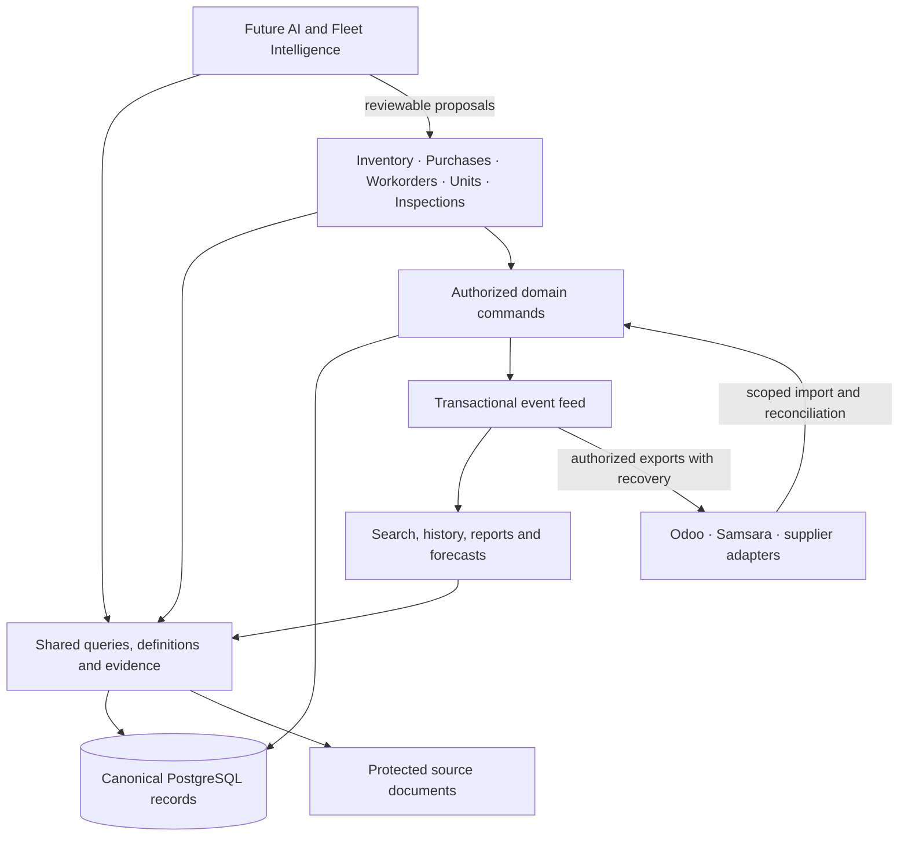

# Full inventory operating model and shared intelligence foundation

Date: 2026-09-15

Status: **PLAN ONLY.** Architecture and delivery proposal; no implementation, database mutation, deployment, or AI action authority is granted here.

## 1. Decision and scope

Build inventory as a connected operational system: every part can be traced from need and supplier through acquisition, storage, reservation, use, removal, reuse or disposal, with the related documents, costs, asset, and people. All screens, integrations, reports, and future AI use the same identities, definitions, evidence, and guarded commands.

“Shared brain” means a durable company knowledge and action foundation. It includes verified operational facts, approved reference knowledge, source documents, business definitions, and explainable recommendations. It is not a chatbot memory, a second stock database, or a model allowed to invent inventory state.

This master plan owns the whole inventory architecture, cross-module contracts, shared intelligence, and overall delivery sequence. [Purchases and Invoice Consolidation](PURCHASES_INVOICE_CONSOLIDATION_PLAN.md) remains its detailed purchasing/invoice subplan. Existing [Inventory Walkthrough](../INVENTORY_END_TO_END_WALKTHROUGH_PLAN.md), [Custody and Reuse](SIMPLIFIED_INVENTORY_CUSTODY_CONDITION_AND_REUSE_PLAN.md), and [Cost and Price History](SERIALIZED_UNIT_BATCH_COST_AND_PRICE_HISTORY_PLAN.md) supply specialist requirements. Where earlier page layouts or delivery sequences differ, use this master sequence; do not weaken their identity, custody, financial, or permission safeguards.

Preserve current Workorder form and role behavior. Improve inventory underneath those interactions; do not force mechanics through purchasing, bins, accounting, or AI setup. Future Fleet Intelligence is a read/recommendation workspace connected to Operations, not another workorder execution queue.

## 2. Starting point and evidence limits

Current workspace: Workorder Generator, HEAD `b174c7a` with existing uncommitted changes. Developer `src.zip` was inspected separately. A source file, historical verification note, or shipped-looking tab is not proof of current hosted behavior.

| Area | Current source foundation | Full-system gap |
| --- | --- | --- |
| Part identity | Company catalog, reference numbers, tracking mode, UOM, provider mappings | Verified supplier aliases, governed fitment/substitution, merge/conversion policy |
| Local stock | Receipts, location balances, stock movements, serialized identities, manual aggregate intake | Complete bucket/position ledger and shared cross-workflow reservation ownership |
| Workorder usage | Exact and aggregate reservation, pending installation, approval consumption | Bind legacy requested supply to physical reservation; shared physical/financial projections |
| Parts supply | Requests, allocations, fulfillment suggestions, stocking policies | One demand record across workorders, transfers and purchases, with no duplicate commitments |
| Invoices | Protected source, extraction, review, receipt lineage | Shared purchasing invoice identity, PO matching, later-document links, partial coverage |
| Custody/reuse | Existing removal, custody, condition, policy/grant and reuse owners | Complete integration of stock-origin damage, transfer, repair, return, unit timeline |
| Developer purchasing/tasks | POs, requests, direct receipts, bills, transfers, counts, reports | Not merged here; migration, partial receiving, count/reservation, timeline, and UI regressions from review need repair |
| Units/inspections | Assets, workorder/service history, inspection results | Reviewed failure taxonomy, installation episodes, applicability and exposure data for forecasts |
| AI helpers | Existing invoice and parts/chat provider seams | Shared typed facts/tools, permission-aware evidence retrieval, evaluations, proposal lifecycle |

Implement against verified current owners, not stale “missing feature” sections of older documents. Baseline reconciliation and a capability matrix refreshed from source/runtime are first delivery tasks. This planning pass does not certify live quantities, performance, or deployment.

Concrete integration gaps found in this review: printable `form_data.parts`, legacy `workorder_part_requests`/`part_allocations`, fulfillment suggestions/legs, and canonical exact/aggregate usages are distinct representations. Fulfillment approval currently records approval only; it does not reserve stock. Odoo outbound mapping and local service-history part extraction still read printable JSON rows. Their eventual replacement must preserve manual/customer-supplied and billable evidence while sourcing actual stock use from canonical usages.

## 3. Connected architecture



Start with the existing application and PostgreSQL. Define strong module boundaries rather than immediately adding microservices, a graph database, or a vector database. Derived indexes may be added when measured needs justify them; stock authority remains in transactional owners.

### Domain ownership

| Domain | Sole authority | Consumers |
| --- | --- | --- |
| Catalog | Part identity, tracking, UOM, reviewed compatibility/reference data | Every module |
| Inventory | Quantity, availability, exclusive reservations, stock positions, physical movements | Stock UI, workorders, purchasing, AI |
| Custody/assets | Exact-unit holder/condition and installation/removal episodes; shared with Inventory guards | Units, workorders, returns, warranty |
| Demand/fulfillment | Need, source plan, allocation and satisfaction links | Workorders, inspections, replenishment, purchasing |
| Purchasing | Supplier, PO revisions/approvals, supplier commitments | Receiving, invoices, reports |
| Documents/commercial | Invoice identity, review, signed charges, allocations, bill/credit/payment evidence | Costs, PO detail, source viewer |
| Workorders | Job, assignment, concerns/repair, work status and approval | Inventory usage, Units, history |
| Inspections | Observed answers, measurements, defects, reviewed follow-up | Workorders and maintenance proposals |
| Integrations | External IDs, sync state, payload evidence and reconciliation | Domain import/export services |
| Intelligence | Derived metrics, reviewed classifications, policy recommendations, model proposals | Operators and AI tools; never source stock |

Shared ownership means one transaction can invoke several domain guards. It does not mean several repositories independently rewrite the same balance or reserve the same serial.

## 4. Operator experience

Keep four inventory views and existing adjacent modules:

| Surface | What user does | Main next actions |
| --- | --- | --- |
| Stock | Find part, availability, exact units, bins, batches, history | Add stock, scan, move, count, request supply |
| Purchases | Needs ordering, POs, invoices | Create/approve order, upload invoice, receive goods |
| Tasks | Put-away, transfers, counts, returns, damage/repair, discrepancies, core/warranty follow-ups | One next action on each task |
| Reports | Usage, coverage, cost, supplier performance, stock accuracy | Filter, inspect source records, export permitted data |
| Workorders | Request/add/use parts, record job and completion | Existing actions enriched by stock truth |
| Units | Current fitted parts, history, upcoming service, removal/condition | Open job, inspect history, initiate existing allowed lifecycle |
| Fleet Intelligence — later | Fleet demand, repeated defects, coverage and service suggestions | Review explanation; open/create draft through existing module |

Do not add a separate top-level page for every lifecycle state. A task is a view onto the underlying receipt, shipment, count, unit, claim, or invoice, not a second copy of that record. Every task carries owner, shop, due/age when meaningful, linked object, blocker, and clear next action.

Shared details:

- **Part detail:** availability by shop/position; tracking and units; receipt batches; open demand/incoming; approved alternatives/fitment; purchase/usage history; costs only if permitted.
- **Exact-unit detail:** identity, current physical holder/position/asset, condition, reservation, acquisition and documents, installation/removal/repair episodes, warranty/core links, complete sourced timeline.
- **Batch detail:** acquisition source, received/remaining quantities, covered serials, location movements, document/cost coverage. Print batches are not acquisition batches.
- **One scanner:** recognize unit, catalog barcode, position, or shipment label; resolve allowed context; show correct next action. Scanning resolves identity; it does not imply physical receipt, fitment approval, or disposal.
- **One search model:** part numbers/references, description, verified supplier numbers, exact serial, batch, workorder, unit number/VIN. Explain match type; never silently substitute an exact typed unknown part number.

Normal work gets prefilled context and one explicit consequential action. Exceptions get focused correction. No repeated company, shop, supplier, part, or unit selection when existing context is valid. Server still validates all context.

## 5. Shared vocabulary and stock truth

### Keep independent facts independent

Separate part identity, company/customer ownership, physical holder, condition, reservation, installation, acquisition, documents, commercial approval, and payment. Examples: a credit does not prove a returned core; invoice does not prove delivery; pending installation is not shelf stock; a warehouse location does not prove company ownership.

Use permanent internal IDs for company, part, exact unit, acquisition batch, position, demand, PO line, invoice line revision, receipt line, workorder usage episode, asset installation episode, claim, and command. External IDs, supplier part numbers, VIN and printed serials are references with explicit scope and provenance.

### Quantity definitions

| Quantity | Definition |
| --- | --- |
| Available now | Physically eligible stock, usable condition/ownership, less exclusive allocations; never includes held or in-transit goods |
| Reserved | Active exclusive allocation to a named workorder, transfer or supplier-return workflow |
| On shelf | Goods physically at shop storage/receiving positions, by condition; show usable and held separately |
| With job / pending approval | Physically picked/issued/fitted goods still awaiting the existing workorder accounting approval |
| Held / repair | Physically tracked but unavailable pending inspection, repair or dispute |
| Incoming | Confirmed supplier/transfer commitment not yet physically received; distinguish unapproved requests |
| In transit | Dispatched quantity not yet accepted at destination; unavailable at both ends |
| Installed | Confirmed current asset placement; historical accounting status may separately be pending |
| Unknown | Missing evidence; never quietly converted to zero, available, new, paid or failed |

### Preserve Workorder accounting while adding physical positions

Current `inventory_items.quantity_on_hand` can still include exact units installed pending Office approval. Therefore do not equate it with shelf count or require only `in_stock` serials to sum to it.

Compatibility reconciliation must identify buckets explicitly:

```text
Current accounted on-hand
  = accepted unconsumed storage balances (including storage reservations)
  + accepted unconsumed unassigned storage
  + allocated goods outside storage but awaiting consumption approval

Available now excludes every active exclusive reservation,
held/disputed goods, goods in transit and non-company stock.
```

Held stock removed from existing usable/accounted on-hand remains in a separate physical custody balance. Customer property is a separate owner bucket. Do not add both custody and accounting totals as if they were separate goods. A unit has exactly one current physical placement even while represented in a compatibility accounting bucket.

Example: 10 units, reserve 2, fit 1 pending approval. Available = 8; physical shelf = 9 (including the other reserved unit); asset placement = 1; existing accounted on-hand = 10. Approve that installed unit: accounted on-hand = 9, reserved = 1, available remains 8. No second physical move occurs at approval.

This refines older `positions + unassigned = on-hand` shorthand: include explicit off-shelf pending-accounting buckets whenever preserving current Workorder semantics. Counts compare equivalent physical buckets. Display a breakdown before changing any legacy On hand label/meaning.

Accepted goods awaiting put-away may belong to accounted stock while their position is not pickable. Availability is computed from eligible free physical positions/buckets, not blindly from accounted on-hand minus every reservation. Count allocated goods once; off-shelf reserved quantities are already outside the available-position pool.

### Required Workorder transition contract

Phase 0 must produce an executable transition matrix for the existing exact and aggregate paths. The following exact-unit deltas define the target normal flow for quantity Q. “Pending” is the accounting bridge for picked/fitted goods outside storage; installed placement is a physical subset/state, not another quantity to add to that bridge.

| Action | Accounted on-hand | Usable storage | Off-shelf pending | Reserved | Available | Physical result |
| --- | --- | --- | --- | --- | --- | --- |
| Reserve from eligible shelf | 0 | 0 | 0 | +Q | -Q | Still on shelf, exclusively allocated |
| Pick reserved goods | 0 | -Q | +Q | 0 | 0 | Named job/operator custody |
| Fit already-picked goods | 0 | 0 | 0 | 0 | 0 | Asset placement starts; reservation retained |
| Fit directly from shelf | 0 | -Q | +Q | 0 | 0 | Combined pick/fit evidence; no second pick |
| Approve fitted usage | -Q | 0 | -Q | -Q | 0 | Same asset placement; no new physical move |
| Release unpicked reservation | 0 | 0 | 0 | -Q | +Q | Same eligible shelf position |
| Return picked but unused goods, accepted usable | 0 | +Q | -Q | -Q | +Q | Actual receipt back to eligible shelf |
| Remove fitted pending-approval goods into hold | -Q | 0 | -Q | -Q | 0 | End asset placement; hold/custody +Q |
| Remove already-approved installed goods | 0 | 0 | 0 | 0 | 0 | End asset placement; hold/custody +Q |
| Release inspected company-owned held goods | +Q | +Q | 0 | 0 | +Q | Hold/custody -Q; eligible storage +Q |

Cancellation can use reservation release only for physically unpicked goods. Picked/fitted goods require their actual return/removal route; no cancellation may imply a physical return. Returning a job for revision is not a physical movement and cannot release fitted exact identities. For aggregate/bulk usage, define equivalent reserved/pending/consumed quantities and actual measurement/correction evidence; do not invent per-unit placements for fluid or nonserialized parts. Zero-delta events remain necessary evidence. Existing pending-removal custody accounting must not be charged again on later Workorder close.

### Ownership/title contract

Record owner class (company, customer, supplier/consignment, unknown), owner reference, acquisition/authority evidence, effective date, reviewer and version separately from holder. PO goods inherit reviewed acquisition terms/evidence; receipt confirms actual custody and must not assume title solely from arrival. Customer-supplied parts are eligible only for their permitted customer/job scope, not general company stock. Consignment requires explicit agreement for when use transfers title and creates cost/payable; unsupported consignment stays segregated. Unknown/disputed property remains held.

Ownership change is an audited command with no implied physical movement. Recheck current reservations, customer/job restrictions, disposal/return authority and associated commercial event. Never satisfy company core obligation, count company-owned valuation, or allocate vendor/customer goods to general demand without documented entitlement. These are operational evidence rules; terms come from reviewed agreements, not AI inference.

## 6. Catalog, fitment and opening inventory

### Catalog

- One company part master; separate quantities by shop, owner, condition, position and batch where needed.
- Tracking is quantity, serialized, or measured/bulk. Lot/batch and expiry are optional traceability attributes, not reasons to serialize every bolt.
- Preserve stocking UOM and precision. Purchasing pack sizes/conversions are versioned; receive in canonical stocking units using approved conversion evidence.
- Track manufacturer, primary/reference numbers, verified supplier aliases, barcodes, criticality, shelf life where relevant, preferred stocking/picking rules, reusable/core/warranty policies.
- Fitment is an approved relation to model/configuration/component position. Prior use is historical evidence, not proof of compatibility. Unknown fitment stays unknown; substitutions need approved equivalence and operator authorization where relevant.
- Tracking changes or identity merges after activity use reviewed conversion/supersession with reconciled quantities, serials, reservations and historical links. Do not overwrite identity or duplicate costs.

### Manufacturer identity migration

Target identity: company + verified manufacturer ID + normalized manufacturer part number. First audit current uniqueness constraints, number-based joins, imports and provider mappings. Two manufacturers using the same number must remain separate. Unknown manufacturer remains unresolved; supplier numbers/barcodes are scoped references. Backfill verified matches, queue ambiguities, preserve historical IDs through adapters, then enforce the new constraint. No automatic merge based only on normalized number.

### Opening stock and installed baseline

- Separate opening inventory, new acquisition, found/recovered item and baseline installed part. No fake invoice, installation date or supplier receipt.
- Import observations with source rows and unresolved matches. Zero is real, blank is missing, fractional bulk respects UOM.
- Serialized opening stock requires captured identities or explicit registration of unlabelled units; retain internal identity and provenance. Unlabelled item must not become two items when scanned again.
- Existing installed part baseline belongs to asset/position with known/unknown identity, date, condition, ownership and evidence. It does not add shop stock.
- Unknown/customer ownership stays segregated. Later invoice/ownership evidence links to original acquisition/custody record without re-receiving.
- Start legacy stock at Unassigned physical position, then put away; never invent bin-level quantities from one text bin field.

## 7. Storage, receiving and movements

### Storage foundation

Model existing authorized shop/site → warehouse → zone/room/area → aisle → rack → shelf → bin as a flexible parent-child tree. Users may skip levels or store large items directly in an eligible area. Separate structural kind from operational purpose: receiving, usable storage, quarantine, returns, repair staging or dispatch. Grouping nodes cannot directly hold stock; storage nodes may hold it. Each node has stable ID, unique case-insensitive shop code, name, parent and version. Display the full derived path, support search and child creation, and preserve historical identity when renaming. Reject cross-shop parents and cycles. Archive only empty nodes without active children/reservations; never delete history. Legacy stock goes to explicit Unassigned, never a guessed shelf.

Research basis (2026-09-15): [Odoo locations](https://www.odoo.com/documentation/18.0/applications/inventory_and_mrp/inventory/warehouses_storage/inventory_management/use_locations.html) documents parent locations and hierarchical paths; [Microsoft inventory locations](https://learn.microsoft.com/en-us/dynamics365/supply-chain/inventory/inventory-locations) documents warehouse/aisle/rack/shelf/bin coordinates; [Microsoft warehouse location setup](https://learn.microsoft.com/en-us/dynamics365/supply-chain/warehousing/tasks/configure-locations-wms-enabled-warehouse) distinguishes codes, zones and location types. Our design adapts these patterns to existing company/shop authorization and local stock ownership. It does not introduce external WMS synchronization or a 3D floorplan. Physical positions and accounting-only pending buckets must remain distinguishable. Disabled positions with balances cannot be deleted out of history.

Aggregate stock has position/batch balances; exact units have one current placement. Every move records from/to, quantity/UOM or unit IDs, actor, reason, effective/recorded times, operation ID, and related receipt/job/task. Internal moves conserve shop totals. Zero accounting-delta events still record physical movement.

Normal put-away: open receipt task → scan position → confirm suggested quantity/units. A one-position shop defaults automatically; large shops use preferred position then deterministic fallback. Workorders do not get a mandatory bin selector; inventory determines pick source and records it. Conflicting reservations/picks fail before mutation.

### Acquisition and receiving

- From PO, invoice or Add stock, enter the same receiving command with source context prefilled.
- Accept partial deliveries, held damage, rejections, backorders and explicit overdelivery resolution. Actual quantities/identities are confirmed once; PO complete status is derived from lines.
- Accepted stock enters receiving position, then put-away if needed. Configure whether that position is pickable; show “awaiting put-away” separately rather than claiming all received goods can be picked.
- Capture batch/lot/expiry when required by part policy. Duplicate serial or wrong tracking/UOM rejects affected atomic unit of work.
- Receipt, accepted/held quantities, labels, events, source allocations and command result commit together. Large manifests may have explicitly independent line operations with clear per-line results; never present partial success as all received.
- Printing/reprinting uses the same identity. Label generation is not printer success; printer/device proof remains separate.

### Transfers

Request → source allocation → dispatch → in transit → partial/full destination receipt. Draft transfer reserves nothing; approved allocation uses shared exclusive reservation owner. Actual dispatch removes source availability once. Destination receipt preserves identities/batches and records actual placement; damage enters hold.

Both shops see the same shipment. Wrong/extra units enter discrepancy custody, expected lines stay outstanding. Lost/damaged-in-transit cases record evidence and approved resolution. An invoice, label scan, or transfer approval alone cannot complete physical dispatch/receipt.

### Cycle counts

Count selected area/part with saved observation watermark and physical scope. Exclude separately tracked job, transit and repair buckets; show their reconciliation separately. Include valid reserved-on-shelf identities without treating them as available.

Approve counted variance only after checking relevant movements/identity versions since observation. Changed affected lines need recount; unrelated lines can finish. Missing units retain identity with unknown/loss custody; found units enter reconciliation, not automatic new purchases. Count correction cannot consume another workorder's reservation or silently restore installed parts.

## 8. Demand, purchasing and invoices

### One demand and fulfillment chain

Need may originate from Workorder, inspection follow-up, scheduled service, minimum stock or authorized manual request. Store origin and requested identity/UOM/quantity, urgency, need-by date, target shop/job, and evidence. Deduplicate suggestions, not distinct real jobs.

Supply options use the same stock truth: eligible local stock → approved substitution → timely same-company transfer → purchase. Rank by eligibility and need-by time before price. Show a simple reason and source; do not mark a recommendation as reservation.

Preserve request → approved demand → allocation → PO/transfer line → receipt → job reservation → usage links. Buying for a job does not satisfy it until eligible stock is received and assigned. On receipt, fulfill the original demand before making its allocated quantity generally available, in the same guarded transaction. Existing stock requests, new purchase requests and minimum-stock suggestions must not order the same shortage twice.

These are many-to-many quantity allocations, not one foreign-key chain: a demand may split across stock, transfers, several PO lines and receipts; one purchase/receipt line may serve several demands. Allocation rows carry source/target IDs, quantity, canonical UOM, conversion/version, current state, cancellation/substitution lineage and evidence. Under locks, active allocations cannot exceed remaining eligible source capacity or demand quantity. Source planning, physical reservation, received coverage and consumed outcome are distinct stages; superseding a source plan releases only its still-unexecuted capacity. A substitute satisfies the original demand through an explicit relation rather than creating a second demand.

Transfer candidates remain informational until canonical transfer reservation/dispatch/receipt is available in Phase 5. Earlier phases must not count an unexecutable suggestion as committed supply or offer a completion action. Existing executable transfer history, if integrated earlier, must first pass the same shared ownership contract.

### Purchasing and documents

Use the [invoice consolidation subplan](PURCHASES_INVOICE_CONSOLIDATION_PLAN.md): Needs ordering, Purchase orders, Invoices; upload + confirm clean matches; no-PO path; partial/multiple invoices; shared reviewed invoice and bill identities; credit/service line distinctions.

Add supplier acknowledgement/expected delivery and actual receipt milestones where evidenced. PO approval/placement and supplier communication are separate facts; do not infer a supplier accepted an order because Office approved it. Communication remains manual or explicitly authorized through configured adapter.

Keep ordered, cancelled, delivered, accepted/held/rejected, invoiced, paid and received-into-stock quantities/statuses distinct. Shared commitment projection subtracts each supply once and accounts for held/rejected outcomes without overstating availability. Attach later invoices to existing goods without stock movement.

Supplier performance derives from actual promised vs usable-received dates, fill rate, damage, returns and confirmed prices with sample sizes. Unrecorded promises or communication are unknown, not late or successful.

## 9. Workorders and asset lifecycle

### Jobs, counter handoff and fitment

A Workorder remains the parent repair record. Add stable child job IDs for distinct concerns/operations, with assignments, labor, status history, demand, handoffs, usage and cost links. Single-job workorders retain the simple form; expose grouping only when needed. Backfill one default job where no reliable finer mapping exists, preserving original row/usage IDs; ambiguous historical attribution stays unknown. One job waiting for parts does not prevent another from proceeding. Parent completion requires required jobs resolved or explicitly deferred/cancelled and physical parts reconciled. Job progress alone does not replace Office consumption approval.

Extend the existing request queue: claim → suggested pick → scan/confirm → handoff to named mechanic/job. Claiming queue work does not reserve stock. Reservation uses shared locks and ownership; actual picking changes physical custody under Section 5. Scan validates unit/SKU, requested part or approved alternative, quantity, pack conversion, condition, ownership, scope and reservation. Separate Office issue permission from mechanic installation/return reporting; migrate explicit existing mechanic grants without silently revoking or broadening them.

Before releasing compatibility-controlled parts, validate approved fitment against effective asset configuration and component position. Version configurations and evidence with effective dates so later engine/component changes cannot rewrite past compatibility. Unknown/conflicting fitment blocks ordinary release until evidence review or an authorized, reasoned override under an explicit policy. General consumables may have approved not-applicable classification. AI labels and prior use are evidence/suggestions, not fitment approval. Full ranking follows this minimum gate.

Deliver counter discrepancy recovery alongside handoff: report empty bin, wrong part/pack, damage or mismatch; hold affected goods and affected allocations; select another eligible source; perform scoped recount and authorized correction with movement/version checks and reason. Never require a fake issue/return to fix a mismatch. Full scheduled cycle counts can follow later.

For inexpensive consumables, configure job-attributed usage or approved shop-consumption batches by part/UOM. Both record physical depletion and cost evidence; shop consumption never invents a job or serial. AI distinguishes job usage from shared shop consumption.

### Normal job

1. Existing Workorder opens for asset and shop; authoritative module/assignment permissions govern user actions.
2. Existing request/add/scan action resolves part and eligibility. Office remains default allocation owner; mechanic scanning uses existing explicit grants.
3. Reserve exact unit or aggregate quantity once. Suggested fulfillment, PO approval and catalog selection do not reserve additional stock implicitly.
4. Inventory determines pick position, tracks physical handoff/placement and remembers job link. Mechanic sees part and required action, not ledger fields.
5. Installation/use records existing pending-approval state. Office approval consumes once in the Workorder transaction; event links usage to asset, job, part/batch/unit, cost version and repair context.
6. Unused return restores eligible availability only after physical custody and condition are valid. Used removal enters removal/inspection; it is not an unused return.
7. Reassignment changes people on the job, not part identity, ownership or stock. Preserve the current local reassignment repair.

Legacy allocations and exact/aggregate usage must bind to a shared exclusive reservation contract. Migrate with per-reservation ownership and audit; do not simply add legacy reserved totals to new reservations.

### Shared Workorder parts projection

Create one classified read projection for Workorder display/print, asset service history, Odoo export and AI. Each row identifies whether it is canonical stock usage, manual/customer/mechanic-supplied evidence, requested/planned quantity, labor/service, or an explicit billing adjustment. Exact/aggregate consumed quantities derive from approved usage; requested or printable rows are not consumption evidence. Non-stock/manual rows retain their source and verification class instead of being dropped.

Keep billable quantity/pricing distinct from physically consumed quantity. Odoo stock-related export rows must reconcile to the canonical approved usage or show an explicit supported billing difference. Replace fragile line-index identity with stable row/usage IDs through a compatibility adapter; retain old export mappings and prevent duplicate outbound orders during migration. Inspection finding links to part/component/usage/asset episode and demand are additive reviewed relations; an inspection failure never auto-consumes stock.

### Removal, handoff, repair and reuse

End active installation episode → record actual holder → receive removed unit on hold → inspect → select eligible route: reusable, repair, warranty, core return, supplier return or scrap. Keep original serial across each route. Quantity goods follow quantity/UOM condition balances; bulk used/contaminated material does not return as fresh stock.

Reuse/repair/disposal require existing role/capability and catalog policy guards, plus physical evidence. Repair completion records findings and condition; release to available is explicit. A cost reversal alone cannot prove used goods are physically back and reusable. Recoveries of previously lost/scrapped items enter reviewed hold.

### Tires, cores and warranty

- **Tires:** one casing identity across mount, rotate, remove, repair and retread; axle/position, mileage/hours/date and measurements; approved fitment rules. Rotation changes position, not acquisition or identity.
- **Cores:** separate deposit obligation, physical core/return episode, and vendor credit. Old removed core may differ from replacement unit. One core fulfillment cannot satisfy two obligations; partial credits allocate against remaining eligible amount.
- **Warranty:** source terms and eligibility evidence, claim, supplier decision, outbound custody, replacement/credit and closure. Eligibility is provisional until acceptance; replacement is a linked new identity, not edited old serial.
- **Supplier returns:** authorization, outgoing custody, accepted/rejected result, credit and any returned-item hold. A rejection/recovery preserves same identity.
- **Scrap/loss:** approved reason/evidence and terminal unavailable state; no deletion of history or disposal of ownership-unknown/customer goods through ordinary company stock actions.

### Financial obligations and job closure

Core/return/claim tasks include owner, due date, source terms, expected recovery, actual credit and unresolved difference. Proposed closure rule: pending vendor credit does not block otherwise completed repair work. Keep the obligation open in Tasks/Reports with its original job link; closing a job never writes off its balance. Unresolved physical disposition or fitted-part reconciliation can block closure. Any financial-period or customer-billing hold is an explicit separate policy, not inferred from a generic credit-pending status.

## 10. Connections outside Inventory

| Module/system | Reads from inventory | Sends/links to inventory | Guard |
| --- | --- | --- | --- |
| Workorders | Availability, approved alternatives, reservations, usage/cost evidence | Demand, allowed reserve/use/return, approval | Existing module/assignment and lifecycle rules |
| Units/assets | Current installation, source/repair/claim timeline | Asset context, verified removal/baseline | No invented install date or fitment |
| Inspections | Relevant fitted part, policy/reference evidence | Observed defect/measurement, approved follow-up demand | Failed answer is observation, not confirmed root cause or stock use |
| Operations/queues | Supply blockers, next action, task status | Existing job routing/approval | Same job/task IDs, no duplicate queue owner |
| Odoo | Authorized mappings/exportable facts | Scoped external catalog/history and reconciliation evidence | Provider stock projections never overwrite local balances |
| Samsara/VIN sources | Asset references where needed | Telemetry, odometer/configuration with timestamps | Telemetry cannot imply part installation or physical stock move |
| Accounting/export | Approved bills, credits, usage/cost snapshots | External posting/result references | Export is recoverable/idempotent; no two bill authorities |
| Supplier communication | Order/return references | Acknowledgement/quote/delivery evidence | External send requires authorized action |
| Scanners/printers | Authorized IDs/label data | Observed scan/print outcome | Manual fallback, no duplicate identity on reprint |

Odoo remains optional for daily local inventory. Preserve provider-managed catalog fields until an explicit catalog-ownership cutover/mapping policy resolves them. Asset telemetry/source ownership remains in integration/asset owners. Capture source time, import time, external revision and freshness separately.

## 11. Cost, pricing and reports

Operational cost follows acquisition evidence and later reviewed allocations. Exact-unit attribution and batch cost retain source lineage; quantity/bulk costing uses a configured, versioned operational method after reconciliation. Do not infer statutory accounting treatment from serial tracking or change accounting policy through this plan.

Proposed operational cost policy: exact units retain invoice-attributed acquisition cost; interchangeable quantity/bulk stock uses a versioned moving weighted-average pool by company, part, owner and currency, with location policy explicitly configured. Missing cost stays incomplete coverage, never zero in an average. Capture a provisional cost reference at handoff and a reproducible usage-cost snapshot at Office consumption approval. Changes between those events may change the final cost and must be explained. Late evidence creates attributable adjustment versions; preserve originally approved and explicitly adjusted report views. Returns reference original usage/cost evidence rather than current shelf price. Define and test pool rules for late evidence, recovered goods and negative-stock handling before enabling totals. Formal valuation remains separately governed; this plan does not adopt a blanket weighted-average-at-counter rule.

Keep merchandise price, approved acquisition charges, refundable core deposit, tax/fees, selling price, and payment evidence distinct. Unknown remains Unknown; explicit zero requires evidence. Preserve currency and decimal precision. Do not sum currencies without a governed rate snapshot.

Transfers carry cost without new purchase/consumption. Reuse/repair records incremental cost separately. Late invoice correction creates cost adjustment/version, preserving original reports and dependent usage lineage. Core refunds affect deposit recovery, not misleading reductions in part-price history. Selling/internal prices have effective dates and approval; they never rewrite past usage prices.

Reports share definitions and source drilldown:

- Stock by shop, position, owner, condition and reservation; physical vs accounted reconciliation.
- Outstanding demand, incoming supply, job shortages and projected coverage without double-counting allocations.
- Actual approved usage net of valid reversals, separated from requests, reservations and physical installation observations.
- Cost coverage, purchases, parts-used cost, repair cost and stock valuation only where method/data are approved.
- Supplier lead time/fill/damage, dead/slow stock, expiration risk, transfer aging, count accuracy.
- Core deposits due/recovered, warranty/supplier-return status, approved bill outstanding and payment evidence.
- Every report states date basis, source freshness, UOM/currency, exclusions and unknown coverage. Exports enforce the same permissions as UI.

## 12. Shared brain: facts, meaning, evidence and tools

### Layer A — canonical facts

Transactional domain records answer quantities, identities, current placement, reservations, job status, invoices, approvals and money. Read current facts through existing scoped services. AI never reconstructs live stock by counting chat messages or semantic-search snippets.

### Layer B — shared business definitions

Versioned definitions for available, on shelf, reserved, consumed, incoming, overdue, supplier lead time, failure rate, and unknown. UI, reports and AI call the same calculations. Store policy revisions for fitment, reorder thresholds, maintenance intervals, approval, reuse and costing. A definition change has effective date and migration/report impact.

### Layer C — evidence and relationships

Link documents/photos, PO/receipt lines, serial/batch IDs, installation/repair episodes, inspection observations, telemetry readings and reviewed classifications. Keep source references, valid/effective time, recorded time, actor, confidence and verification status. Mark facts as observed, imported, reviewed, inferred or unknown; do not collapse them into one “AI confidence” score.

Use relational links as the initial knowledge graph. Approved manuals and documents may later have permission-filtered text/semantic search. Retrieved document text is evidence, never instructions granting actions or authority. Preserve source revision, access and deletion/retention behavior across all derived indexes.

### Layer D — common queries and typed tools

Proposed service contracts, not new permissions:

| Tool | Answer |
| --- | --- |
| `find_part` | Exact/reference/supplier matches and reviewed alternatives |
| `get_availability` | Current eligible quantity by shop, position, batch and reservation with as-of time |
| `get_part_history` | Receipts, usage, transfers, corrections, costs with source links |
| `get_unit_timeline` | Current holder/asset and complete identity history |
| `get_workorder_supply` | Demand, reservation, shortage, incoming fulfillment and blockers |
| `get_invoice_match` | Reviewed/draft PO/receipt candidates and differences |
| `get_asset_service_context` | Installed parts, reviewed observations, policy due items, exposure freshness |
| `get_inventory_coverage` | Deterministic demand/supply projection with assumptions and sample size |
| `create_supply_proposal` | Draft purchase/transfer/replenishment proposal with exact evidence; no reservation/send |
| `create_service_proposal` | Draft recommended follow-up referencing policy/observations; no diagnosis claim |

Tool outputs include company/location scope, stable IDs, authoritative status, measured-as-of and projection-as-of times, units/currency, policy version, evidence links, known limitations, and allowed next actions. Caller does not choose a broader scope than actor has. Stock command confirmation always rechecks live facts.

Use a common validated answer envelope: `kind` (fact/calculation/estimate/proposal), summary, scope, as-of, facts with units/source IDs, calculations with formula/inputs/version, assumptions, data gaps, freshness, evidence sufficiency, citations, and optional proposal/command preview. The model cannot fill a missing tool value with an invented number. Command tools live in a separate registry unavailable to ordinary question answering.

### Layer E — AI explanation and proposals

AI can answer “Where is this part?”, “Why is this job waiting?”, “Which shops can supply it?”, “What should we order?”, or “What evidence suggests repeated failures?” by composing scoped tool results. Numeric facts come from calculation tools; answers cite supporting jobs, receipts, documents or policies.

AI proposals are durable records: objective, inputs/as-of, proposed lines/action, rationale, alternatives, unresolved assumptions, model/tool/policy versions, expiry/staleness conditions, reviewer and outcome. Approval binds exact proposal payload and revision. Changed stock, price, scope or policy invalidates approval as appropriate. Accepted proposals invoke existing domain commands; AI never writes raw SQL or bypasses normal permissions.

Initial delivery is read-only answers and reviewable drafts. Any later autonomous reorder/action policy is a separate explicit product decision with bounded company/amount/item/supplier scope, limits, audit, revocation and recovery. This plan does not authorize AI purchases, messages, stock corrections, disposal, payment or production writes.

### Durable learning

Store approved supplier aliases, catalog corrections, fitment decisions, reviewed failure labels and validated extraction templates as structured versioned knowledge. Keep rejected/inferred classifications separate. Chat phrasing is not a durable inventory fact. Track who approved learned knowledge, source, scope and expiry where relevant; later correction supersedes rather than erases prior evidence.

Enforce typed record classes and lifecycle status for observation, reviewed fact, inference, policy, recommendation and proposal. Recommendations/proposals/model rationale are excluded from stock, demand, commitments and training inputs by default. Rejecting/expiring a proposal preserves audit evidence but creates no demand. Accepting one invokes a normal command whose resulting domain records/events become facts; approval does not promote the proposal narrative into truth. An inferred supplier alias cannot affect exact matching until reviewed. Retrieval may show rejected proposals as clearly labeled audit history, never as support for current availability.

Start company-local. External model egress uses feature/tenant/data-class policy; redact unnecessary personal/financial data and preserve provider routing/configuration. Do not silently reuse another company's source material or fine-tune on uploaded invoices. Operational reporting continues with local/manual behavior when AI or provider is unavailable.

## 13. Fleet intelligence and prediction ladder

| Stage | Capability | Required evidence |
| --- | --- | --- |
| 1. Find/explain | Current stock, source history, job blockers, overdue tasks | Reconciled IDs/quantities, permission-safe tools, source citations |
| 2. Deterministic advice | Reorder suggestions, due maintenance, source options | Approved stock/maintenance policies, actual commitments and current scope |
| 3. Demand forecast | Expected part demand and stockout risk by shop/fleet cohort | Actual usage/reversal history, lost/unfulfilled demand, lead times, exposure and data coverage |
| 4. Reliability analysis | Repeated component failures, supplier/batch patterns | Reviewed component/failure taxonomy, installation/removal episodes, miles/hours/time and sample size |
| 5. Action proposals | Draft PO/transfer/service plan with explanation | Backtested metrics, policy constraints, current tool snapshot and human review |

For cohorts use verified model/year/engine/configuration or fleet group; VIN text similarity is not a cohort definition. Separate scheduled maintenance from statistical risk. A repair or inspection concern does not prove failure cause. Track installed population/exposure, repeated episodes, replacements, warranty outcomes and censored/missing observations before reporting failure rates.

Forecast inputs distinguish requested, reserved, used, returned, cancelled and substituted quantities. A job request and its approved usage are one demand lifecycle, not two demands. Stockouts suppress observed usage, so retain unfulfilled demand. Planned job demand already reserved or included in forecast must not be counted twice.

Begin with transparent baseline: free eligible availability + free eligible incoming due within horizon − known demand not already covered by reservations/earmarked incoming − forecast of additional uncommitted demand − safety stock. Reservations are already removed from free availability; earmarked incoming and its covered demand cancel outside this free-pool equation. Never subtract those commitments again. Example: 8 free now + 2 free incoming − 3 uncovered known demand − 4 additional forecast − 1 safety = 2 projected surplus. Keep the detailed time-phased allocation model authoritative when dates differ. Each term has explicit time window, UOM and inclusion policy. Backtest against simple historical/policy baselines on time-separated data; show error, coverage, sample size and uncertainty. Suppress inadequate-data predictions rather than imply precision.

## 14. Events, recovery and data quality

Reuse/extend the existing integration outbox pattern (`038_integration_platform.sql`, `integration-platform.repo.js`) for a complete domain event feed; it is not already complete coverage of inventory. Domain state and required event intent commit together. Include event ID/schema version, company/scope, object ID/revision, event type, actor/source, occurrence and recorded timestamps, correlation/causation IDs, source evidence and command key. No competing event queue or distributed event platform is required initially.

Consumers may receive an event more than once. Make projection/export handlers idempotent, preserve per-object ordering/version checks, retry with dead-letter visibility, and support rebuilding from retained facts/events. Search/AI indexes are disposable projections; recovery must not replay physical commands.

Unify timeline coverage across existing unit events, stock task events, usage events and documents through a canonical projection/adapters. Do not create two independent “current unit status” writers. Include physical moves with zero accounting delta, approvals with no new physical move, and superseded evidence.

Automated reconciliation opens one deduplicated discrepancy task for:

- Location/bucket/position totals, serial identities and reservations disagreeing.
- Multiple active placements or claims on same serial; unsupported owner/condition eligibility.
- Receipt vs PO/invoice allocations exceeding allowed coverage.
- Duplicate invoice/bill or unexplained cost/credit allocation.
- Orphaned workorder demand, issued parts without custody, transfer aging or unknown outcomes.
- Stale provider/telemetry readings, ambiguous mappings, missing catalog tracking/UOM.

Reconciliation reports and proposals do not silently adjust stock. Corrections use existing guarded commands with reason, evidence, version and compensating events. Error on one location should not hide valid scoped results elsewhere; AI clearly identifies excluded/uncertain data.

## 15. Permissions and operational controls

Use capabilities on existing roles rather than requiring a new employee role for every task. Define Inventory read, receive/move, reserve/issue, count observe/approve, transfer dispatch/receive, inspection/reuse/disposition, purchase draft/approve, invoice review, cost read/edit, credit/payment evidence, policy admin, and AI query/propose separately.

Actor-effective company, location, asset/workorder/module and document/cost scope applies equally to UI, APIs, tool results, search, exports, caches and citations. Access to a serial does not grant access to its full supplier invoice. Recheck revoked permissions on execution and operation lookup; never use model memory or cached search to bypass access.

Routine receive/pick actions should not gain an unnecessary second approval. Governed high-impact corrections/disposal/financial changes follow configured separation-of-duty rules. Unconfigured policy cannot be interpreted as permission. Keep unresolved tasks pending with actionable assignment; AI is not an approver.

All consequential commands require stable keys, canonical payload hashes, expected versions where relevant, deterministic locks, operation result lookup and atomic evidence. Lost response means Checking result, not safe to submit new action. Offline permits viewing permitted cached summaries/drafting only where implemented; it cannot claim physical/financial confirmation succeeded.

## 16. Migration, integration and rollout

- Preserve dirty workspace and existing fixes; inventory code is integrated by reviewed branch/commit, not ZIP directory overwrite.
- Reconcile historical stock/identity/ownership and pending reservations before adding positions. Map legacy pending states explicitly; do not make counting or AI “fix” differences by dropping reservations.
- Repair developer migration sequencing and historical checksum compatibility; migration 133/145 issue and CRLF changes from earlier review remain prerequisites.
- Add owners/constraints and source mappings in stages. Backfills use known links; ambiguous evidence enters review. No fake dates/serials/bins/invoices to make migration totals fit.
- Preserve document bytes/encryption context, IDs, timestamps, old URLs, payments and exact-unit lineage. New features must not expose retained documents to broader readers.
- Keep one physical writer during compatibility transition. Legacy request/aggregate/exact paths delegate shared guards; old receipt routes cannot bypass newer coverage checks.
- Capture pre/post balances, reservation owners, identity placements, commercial totals and provider mappings. Rehearse empty install, populated upgrade, backup restore and forward recovery in disposable environments.
- Release flag enables a whole usable slice with clear semantics. Do not expose incomplete position quantities or confident AI answers before data gates pass.
- Odoo-disconnected tests run per slice. Git parity, deployment status, health, authenticated browser and actual device proof are separate release evidence. No production action is authorized by this document.

## 17. Orchestrated delivery sequence

**Priority revision — basics first:** Finish a usable basic Inventory release before expanding job/counter workflows, purchasing automation or AI. The first release answers: what part is this, how much is physically here and available, what did it cost, what is its configured selling/internal price, where is it, and what changed? Existing Workorder integration must continue reconciling throughout; new child-job workflows are not a prerequisite for this basic release.

Basic release order: (1) verify catalog/tracking and current balances; (2) purchase-cost visibility, source/history, missing-cost coverage and versioned selling/internal prices; (3) shop/area/shelf/bin positions, opening placement and internal moves; (4) receiving/put-away, physical counts/corrections and damaged-stock exclusion; (5) verify existing reserve/use/return/approval behavior against those quantities, locations and cost references. Retain existing invoice extraction and manual receiving; richer PO matching follows. Basic prices do not wait for advanced valuation, credit allocation or profitability reporting.

| Phase | Scope and output | Release gate |
| --- | --- | --- |
| 0. Truth and contracts | Baseline matrix; executable physical/accounting transition table; ownership/consignment evidence rules; integration diff; canonical reservation/command contracts; capability policies | Legacy/current accounting reconciles; no ambiguous writer ownership |
| 1. Catalog, prices and opening | Tracking/UOM/aliases, baseline registration, ownership, search; source-linked purchase costs/history, Unknown coverage and versioned selling/internal prices | No duplicate identity or fabricated history; opening reconciles; permitted users can distinguish cost from selling price and inspect its source |
| 2. Locations and basic stock operations | Areas/shelves/bins, opening placement, off-shelf pending buckets, internal moves, receiving/put-away, scoped counts/corrections, damage holds and common timeline/outbox | Basic Inventory release: find, price, locate, receive, move and count stock; physical/accounted totals reconcile with existing Workorder use |
| 3. Demand and workorders | Stable child jobs; many-to-many demand/supply allocations; bind requests/reservations; claim/pick/scan/handoff with minimum fitment and immediate discrepancy recovery; classified parts projection; transfer suggestions informational until Phase 5 | Complete job request → handoff → install/unused return journey; no double reservation/consumption; unrelated jobs proceed; print/history/export and explicit mechanic grants preserved |
| 4. Purchasing and invoices | Detailed invoice subplan, PO/no-PO, partial receiving, shared commercial/receipt links | Upload + confirm clean path; goods and payable counted once |
| 5. Transfers and expanded stock tasks | Partial transfer/discrepancy, scheduled count campaigns and advanced task coordination over existing basic count/damage guards | Cross-command concurrency and custody conservation pass |
| 6. Full lifecycle | Removed-part handoff, inspection, repair/reuse, supplier return, cores, warranty, tire episodes | One identity through all episodes; physical and money states independent |
| 7. Advanced costs and reports | Extended cost/credit allocations, governed valuation where approved, lifecycle profitability, shared metric projections and exports; basic prices/history already delivered in Phase 1 | Reproducible totals and source drilldown under permissions |
| 8. Shared AI read tools | Actor-scoped query/evidence contracts, semantic definitions, evaluation set | No invented stock, scope leak, stale unlabelled answer or unsupported claim |
| 9. Intelligence/proposals | Policy advice, measured forecasts, reviewed failure analysis, draft actions | Baseline comparison, confidence/coverage, explicit review and command revalidation |

Shared AI IDs, evidence fields, event conventions and query definitions begin in Phase 0–2; AI UI arrives after reliable facts. The purchasing subplan can proceed in parallel with position read models only where it uses the same receiving/reservation contract. Costs can be captured early; valuation/forecast claims wait for corresponding gates. Source-ready read tools may roll out before all advanced lifecycle features, with unsupported domains explicit.

Security, tenant/location isolation, concurrency, idempotency, audit and compensating recovery are acceptance gates in every phase. Phases 0–2 form the first basic Inventory delivery. Phase 3 then expands job/counter workflows; Phase 4 extends that journey through shortage → purchase → partial receipt. Expanded counts in Phase 5 and advanced reports in Phase 7 do not defer basic count correction, pricing or cost evidence.

Execution orchestration when separately authorized: one architecture owner freezes each slice's contract; implementation owners take non-overlapping frontend/backend/migration boundaries; independent verification checks real database/browser results; independent review challenges cross-writer races and semantic drift. Root integrates and records evidence. Do not parallelize competing stock writers or migration ownership. Every slice finishes a realistic user journey before expanding scope.

## 18. End-to-end acceptance journeys

1. **Job shortage to install:** request part on existing Workorder; local stock insufficient; approve PO; partial receive against original demand; reserve exact received identity; install; Office approve; stock/usage/asset/cost/task projections agree.
2. **No-PO purchase:** upload invoice, confirm no-PO review, receive actual goods, put away, later issue to job; one acquisition and one commercial owner.
3. **Late invoice:** manually received goods already installed or in stock; attach reviewed invoice and cost coverage without changing any physical quantity/identity/date.
4. **Position/count with reservations:** 10 units, reserve 2, fit 1 pending approval; count shelf correctly, transfer only free eligible units, approve job once; reconciliation holds at each step.
5. **Transfer conflict:** workorder reserve races transfer dispatch; only eligible ownership wins, losing command has no partial movement. Partial destination receipt and damage retain shipment remainder.
6. **Full unit lifecycle:** purchase → receipt → bin → job → asset → removal → hold → repair → reuse → second asset; one serial, two installation episodes, complete sourced timeline.
7. **Core/warranty:** replacement and removed core linked to distinct identities; dispatch core; partial credit; rejected return; custody and obligation balances stay independent and bounded.
8. **Bulk and package:** approved pack conversion, fractional bulk usage, correction and contaminated return; no unsupported UOM or invented serials.
9. **Opening/recovery:** mixed zero/fractional/unlabelled observations and customer-owned installed baseline; unresolved evidence stays held/unavailable; later links preserve provenance.
10. **Duplicate/concurrent/lost response:** same invoice and receiving command retried, competing allocations/counts; one receipt, one payable, no stolen reservation or duplicated identity.
11. **Provider independence:** Odoo unavailable/stale, telemetry delayed; local receiving/workorders continue; source freshness exposed; reconnect does not overwrite local stock.
12. **AI exact answer:** ask available quantity and why job blocked; answer equals current authorized query and cites exact source; missing data explicit.
13. **AI evidence/permissions:** invoice embeds malicious instructions, cost access revoked, stale index candidate; instructions ignored, restricted evidence absent, permission rechecked.
14. **AI proposal drift:** propose purchase/transfer, then quantity/price/policy changes; approval bound to old revision cannot execute changed action; no external send without authorized command.
15. **Forecast reliability:** time-separated backtest, sparse cohort, missing exposure and stockout demand; show uncertainty or suppress result, never classify observed repair as confirmed failure without review.
16. **User speed:** realistic Office/mechanic/shop users at desktop/tablet/phone; normal actions use existing context and no repeated data entry; errors/reload retain task and focus.
17. **Migration/recovery:** populated histories including manual receipts, pending installations, uploaded PO documents and payments survive upgrade/restore with equal reconciled source totals.
18. **Split demand/source capacity:** one demand uses local + PO + transfer supply; one receipt serves two jobs; concurrent allocation cannot exceed either demand or source capacity, including cancellations/substitutions.
19. **Ownership change/consignment:** customer, vendor and unknown stock never satisfies general company demand or valuation by custody alone; authorized title change records commercial impact without a physical move.
20. **AI proposal isolation:** rejected/expired proposal and inferred alias remain audit-only; availability, demand, ordering, exact matches and training labels do not change until normal reviewed domain commands create facts.
21. **Cross-module projection parity:** approved stock usage agrees across Workorder, print, asset history, Odoo export and AI; manual/customer/billing differences are explicit, with stable links and no duplicated export.

22. **Independent jobs:** one job waits while another proceeds; assignments/labor/usages remain attributable; default-job migration preserves legacy evidence.
23. **Counter and fitment exceptions:** empty bin, wrong pack and incompatible/unknown controlled fitment do not create an issue; correction or reviewed override uses normal guards.
24. **Last-unit race:** reset an isolated fixture to exactly one eligible unreserved unit, then race two reservations/issues; exactly one succeeds. Test exhausted stock separately: neither succeeds. Do not reuse stock consumed by an earlier alternate-part scenario.
25. **Cost and credit timing:** provisional handoff and final approval snapshots explain changes; late invoice adjusts cost without new stock; pending credit survives job closure with owner and balance.
26. **Manufacturer collision:** equal numbers from different manufacturers remain separate; ambiguous backfill blocks merge; historical and provider links survive migration.

## 19. Definition of done and evidence

Full inventory is complete only when the relevant lifecycle journeys reconcile physical reality, stock/reservations, source links, tasks and commercial evidence under real permissions and concurrency. “Shared brain ready” additionally requires stable identities, common definitions, source/freshness contracts, safe typed tools, rebuildable projections and evaluated answers/proposals.

Verification must distinguish code/unit tests, database migrations/concurrency, responsive authenticated UI, deployed health and exact release revision, and physical scanner/printer behavior. Measure ordinary task actions/time, exception recovery, stock discrepancy rate, document match accuracy, forecast quality and permission violations. Do not substitute a completion percentage, screenshot or number of tabs for these gates.

This is an architecture proposal. No future AI capability, database feature, prediction accuracy or hosted readiness is represented as already implemented.

## 20. Source anchors and review record

Source review anchors (repository-relative paths; line numbers refer to this planning baseline):

- `src/server/db/migrations/065_local_inventory_ledger.sql:54` — location movement ledger and source links.
- `src/server/db/repositories/inventory-aggregate-workorder-usage.repo.js:56,233,289` — reserve, pending and approval accounting.
- `src/server/db/repositories/inventory-unit-workorder-usage.repo.js:354,671,827` — exact-unit reserve, disposition and approval.
- `src/server/db/repositories/inventory-reuse.repo.js:35,172,236` — return-to-stock, pending fitted removal, receipt/release.
- `src/server/db/repositories/part-fulfillment.repo.js:112` — fulfillment approval without stock reservation.
- `src/server/integrations/odoo/odoo.outbound.repo.js:70` and `src/server/db/repositories/service-history.repo.js:476` — printable JSON part projection dependencies.
- `src/server/db/repositories/inspections.repo.js:227` — inspection completion/workorder links.
- `src/server/db/migrations/038_integration_platform.sql:174` — existing outbox foundation.
- `src/server/db/migrations/061_invoice_extraction_learning.sql:45` — correction/candidate/approved learning pattern.
- `src/server/modules/parts-helper/README.md:11` and `src/server/modules/parts-helper/parts-helper.service.js:169` — catalog-first identification and suggestion boundary.
- `src/server/modules/invoice-extraction/invoice-extraction.schemas.js:32` — extracted PO reference currently stored as text.

Two bounded read-only architecture traces covered module connections and AI foundations. A separate skeptical plan review identified five precision gaps: transition deltas, split allocations, transfer phase ordering, ownership/title, and proposal/fact isolation. This revision incorporates those corrections plus shared Workorder projection, forecast double-count prevention and existing outbox reuse. Review concerns were design gaps, not runtime test results. No application/database tests were run for this documentation-only change; file formatting and scope were checked.


## 21. Reconciliation of the supplied specification review

The supplied review describes conflicts with a separate specification. Those descriptions are review input, not proof of implemented or production behavior. The following resolutions control this proposal; implementation remains separately authorized.

| Review issue | Plan decision / owner | Required implementation evidence |
| --- | --- | --- |
| Counter issue versus approval consumption | Inventory handoff changes custody; Workorders approval consumes once; Section 5 | Exact/aggregate transition and retry tests; migrated pending usage reconciliation |
| Weighted average versus invoice attribution | Section 11 separates purchase lineage, operational snapshots and formal valuation | Cost/version fixtures, missing coverage and late adjustments |
| Office issue versus mechanic scanning | Separate capabilities; preserve explicit grants through reviewed migration | Server permission matrix and cross-company/shop denial tests |
| Serialized boolean | Retain Quantity, Serialized and Measured/bulk | Migration, UOM, pack and consumable tests |
| Manufacturer identity | Catalog constraint/join audit and verified backfill | Collision fixtures; historical/provider mapping preservation |
| Availability and holds | Eligible physical buckets; no blind legacy on-hand formula | Reserved/picked/fitted/held/transit reconciliation |
| Job foundation and counter workflow | Stable child jobs and existing request queue; Section 9 | Independent-job and request-to-return browser journeys |
| Configuration/fitment | Effective versions/evidence and minimum pre-release gate | Configuration change, incompatible scan and override tests |
| Purchasing and credits | Extend extraction; separate receipt; obligations survive job close | Partial receipt, duplicate upload/order prevention, credit balances |
| Stale status and migration 130 note | Phase 0 verifies applied migrations and hosted revision; old note remains unverified evidence | Runtime inventory, disposable populated upgrade, separately authorized deployment proof |

Maintain one capability/evidence matrix during implementation: requirement, current code owner, missing behavior, migration/backfill, acceptance test, deployed revision and evidence date. This master owns architecture and sequence; earlier walkthrough and specialist addenda provide linked detail. Avoid competing completion claims. This reconciliation is a documentation review, not runtime verification.
